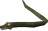

#  Snake
Play snake in game!

## Playing
Collect the orbs for points. Don't collide with your trail or go outside the grid. Diagonal movement is allowed.

### Singleplayer
Shift right-click the overlay and select "Start new game". A countdown will appear and then the game will start.

### Multiplayer
1. All the following config settings must be the same for all players:
   - Game size
   - Allow run
   - Enable multiplayer
   - Seed (optionally change per game to get other spawns)
   - Same food spawn
   - Player names (order does not matter)
2. All players should stand on the same tile and start the game by shift right-click the overlay and select "Start new game".
3. All players should type "r" in public chat to ready.
4. A countdown will appear and then the game will start.

## Config
| Config | Description |
| --- | --- |
| Game size | The size of the game
| Allow run | Allow running
| Grid theme | The theme of the grid
| Enable multiplayer | Enable multiplayer mode
| Seed | The seed used to randomize spawn locations
| Same food spawn | If enabled all players have the same food spawn location, otherwise it is per player
| Show all food | Show all food spawns if same food spawn is enabled
| Player names | RSN of all the players participating, as comma separated list
| Show add player menu | Show add player menu on players
